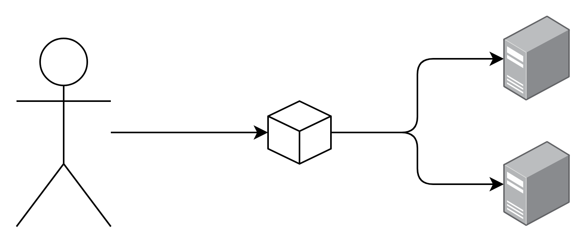
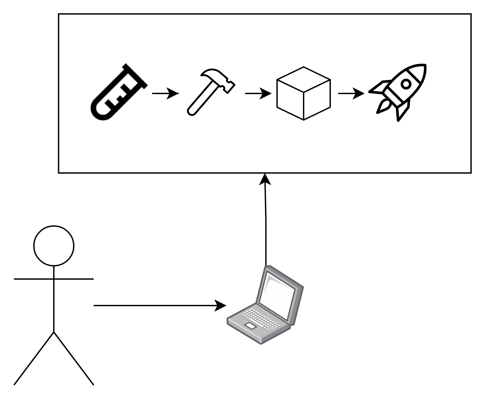

## Agenda

- Traditional Scenario
- DevOps Scenario
- Definitions
- DevOps Phases

---

## Traditional Scenario

<aside class="notes">
    To understand DevOps lets first look at the traditional scenario of software
    development.
</aside>

---

## Develop

<aside class="notes">
    In the traditional scenario a group of developers work on an application over
    specific amount of time. In this time they work independently on the new
    release and then produce an artifact containing the new version of the
    application.
</aside>

---

## Throw

{ width=70% }

<aside class="notes">
    The developers then throw this artifact over an imaginary wall to the
    operations team.
</aside>

---

## Operate

<aside class="notes">
    The operations team then goes through the process of deploying the artifact
    to different environments and monitoring its health. If something goes wrong
    the development team will be pointing fingers at them.
</aside>

---

## DevOps Scenario

<aside class="notes">
    In the DevOps scenario this looks a bit different.
</aside>

---

## Mindset

> you built it, you run it

<aside class="notes">
    Everyone involved in the development of the application needs to have the
    mindset that the things they build are ran by themselfes.
</aside>

---

## Knowledge

<aside class="notes">
    For that to properly happen they need knowledge in every phase of this
    process.
</aside>

---

## Automation

{ width=50% }

<aside class="notes">
    Through lots of automation a quick feedback loop is created and manual tasks
    are kept to a minimal. This leads to the a person involved being able to
    implement a new features, getting quick feedback through automation,
    reviewing the changes through a person and then with mostly a click deploy
    to the environments.
</aside>

---

## Definitions

---

## It depends...

- Dev doing Ops
- Ops doing Dev
- DevOps helping Dev and Ops

<aside class="notes">
    As DevOps is mainly about a mindset this leads to different perspectives.
    One being that the Devs are involved in Ops. Meaning that their main work is
    developing things but they are also involved in some operational parts of
    it. Another one being that Ops is involved in Dev. Meaning that their main
    work is related to building redundancy, performance improvements,
    scalability and so on and in most cases involves more scripting than actual
    implementing the application. The final one being that there is a separete
    team responsible for DevOps related manners and helping out in both Dev and
    Ops teams. This mainly happend when the term DevOps got really popular. With
    the content of this track you should be prepared for all three of the
    definitions.
</aside>

---

## DevOps Phases

<aside class="notes">
    Lets take a look at the different phases in DevOps.
</aside>

---

## Overview

<aside class="notes">
    As already teasered in the DevOps scenario: here the DevOps cycle. The
    arrows in red mark the part were in the traditional scenario the throwing
    over the wall would have happened. Another important thing to know is that
    it is continuous and never ending.
</aside>

---

## Plan

- Define, Track and Prioritize Tasks

<aside class="notes">
    The plan phase is used to map customer requirements and feedback to the
    current work tasks. Based on the input you get from the customers some new
    tasks have to be defined, old ones have to be redefined or even paused and
    some have to be reprioritized. This is mostly done with the help of a
    project management framework.
</aside>

---

## Create

- Design and Develop Code
- Create Project Data

<aside class="notes">
    The create phase is used to implement the tasks defined in the plan phase.
    This can be almost anything from renaming a button on a website to creating
    the infrastructure of an application.
</aside>

---

## Verify

- Automated Quality Assurance

<aside class="notes">
    The verify phase is used to validate the ouput from the generate phase. This
    means making sure that things are working correctly and comply with the
    quality standards. The prefered method of doing this is using automation.
</aside>

---

## Package 

- Produce Product

<aside class="notes">
    The package phase is used to convert the application, library, container,
    etc. into a generally known format so that it can be used by others.
</aside>

---

## Release

- Bring Product to Customers

<aside class="notes">
    The releae phase is used to bring the package to the customer. This means
    deploying an application, using a new library version and so on.
</aside>

---

## Configure

- Manage Infrastructure of Product

<aside class="notes">
    The configure phase is used to provide and manage infrastructure. This means
    actually creating the infrastructure, adding new things to the existing
    infrastructure or destroying end of life infrastructure.
</aside>

---

## Monitor

- Track Metrics and Errors

<aside class="notes">
    The monitor phase is used to track the released software. This means
    collecting and visualizing metrics, logs and traces to gain more insights in
    the application and to be able to quickly react in case of an incident.
</aside>
