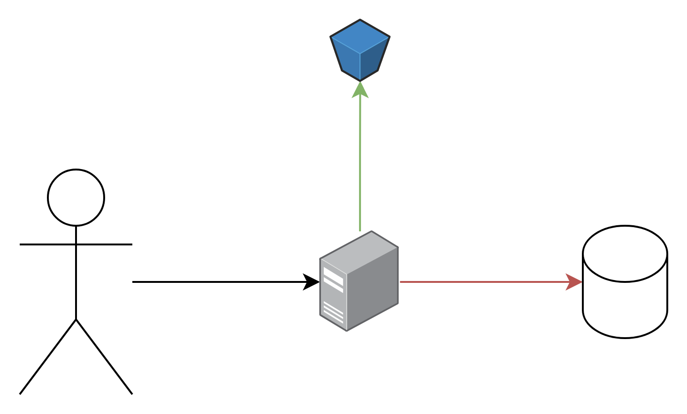

## Agenda

- Monolith vs Micro Services
- Stateful vs Stateless
- Load Balancing
- Proxies
- Persistence
- Caching
- Rate Limiting
- Queues

---

## Monolith vs Micro Services

---

## What is a Monolith

- The complete Application Logic in one Service
- Single Point of Failure
- One Large Codebase
- Traditional but Effective

---

## What are Micro Services

- Logic of an Application split into multiple Services
- Logic Specific Codebase
- Independence

---

## Stateful vs Stateless

---

## What is Stateful

- Service keeps track of Information (State)
- Mostly used with Monoliths

---

## What is Stateless

- Service requires all the Information required
- Mostly used in Micro Services

---

## Load Balancing

---

## What is Load Balancing?

- Distributing load of Service across multiple Instances
- Stateless Applications
- Sticky Sessions

---

## Stateless Load Balancing

---

## Sticky Load Balancing

---

## Proxies

---

## What is a Proxy?

- Server between you and the Internet or a Service
- Privacy, Performance and Security Improvement
- Reverse or Forwarding Proxies

---

## Reverse Proxy

---

## Forwarding Proxy

---

## Persistence

---

## How can I persist Data?

- In Memory
- File Storage
- Databases

---

## In Memory

- Data is stored in Memory 
- Data is lost on Shutdown

---

## File Storage

- Data is stored on disk 
    - on a single machine 
    - on multiple machines 
    - on multiple machines in different locations

---

## Database

- Collection of (un)structured Data
- Allows to analyze the Data

---

## Caching

---

## What is Caching?

- Temporarily storing important Data
- Improves Performance
- Mostly done with In Memory Storage

---

## Caching Example

---

## Rate Limiting

---

## What is Rate Limiting?

- Blocking users that over use a Service
- Mostly done based on amount of Requests

---

## Rate Limiter

---

## Queues

---

## What are Queues?

- Systems that line up Data
- First in, first out
- Asynchronous
- Different Topics
- Producers and Consumers

---

## Queue Example

