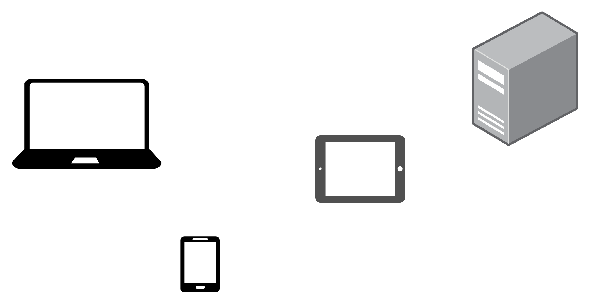
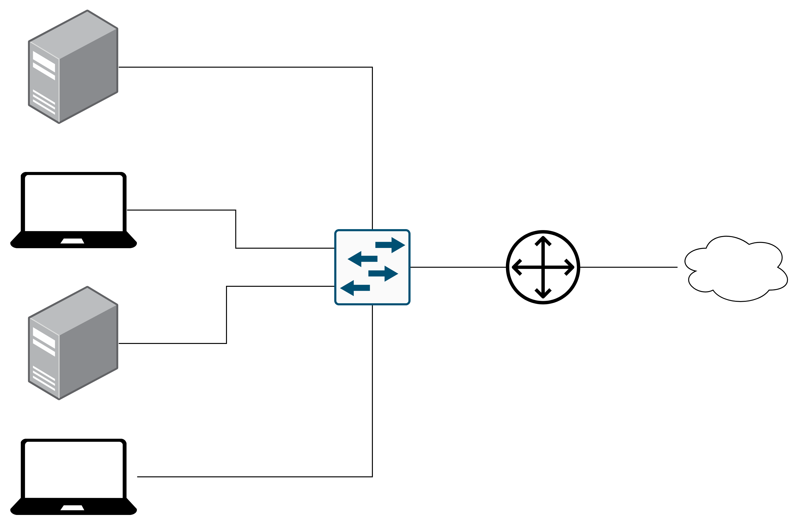
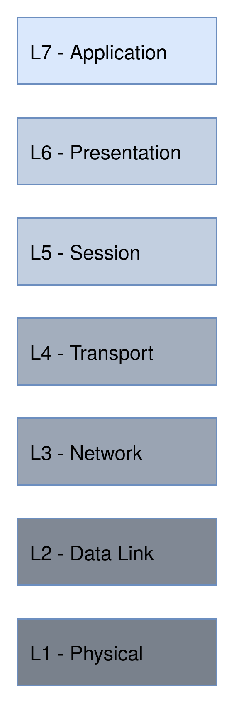
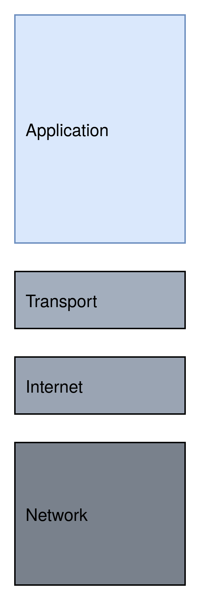

## Agenda

- Basic Terms
- OSI and TCP/IP Model
- Protocols
- Advanced Topics 

---

## Basic Terms

<aside class="notes">
    Lets look at some common terms that we use in terms of networking.
</aside>

---

## Client

<aside class="notes">
    One thing you will often hear is a client. A client represents any device
    within a network. This can be a smartphone, tablet, Laptop, PC or even a
    server.
</aside>

---

## MAC Address

- 12 Character Number assigned to each Client
- Used to address local Clients over Wire or Wireless
- Can usually be changed manually

<aside class="notes">
    Each of these clients has a thing called MAC address. It is a 12 character
    number burnt into the devices network card. It is used to address clients
    within the same network also called local area network or LAN. For your
    information just because it is burnt into the network card it does not mean
    that it can not be changed. 
</aside>

---

## IP Address

- Two Version 4 and 6
- 32 or 128 Bit
- Used to address Clients
- Can be changed within the local Network
- Mostly fixed for public IP address

<aside class="notes">
    Each client also (almost always) has a so call IP address. It is another
    identifier to address clients that has two version. In version 4 it is 32
    bit long in version 6 128 bit long. It can be changed within the local
    network but is fixed when connecting to the internet.
</aside>

---

## Switch

{ width=40% }

<aside class="notes">
    A switch is a device that physically connects multiple devices. This allows
    them to communicate with each other with the help of MAC addresses.
</aside>

---

## Router

{ width=70% }

<aside class="notes">
    A router is a device that connects a network to another network. This can
    either be another local network or the internet. Which in theory is a
    network as well. Clients trying to connect to a device that is not in the
    local network can go over the router to reach it. The router will then take
    care of the rest.
</aside>

---

## OSI and TCP/IP Model

<aside class="notes">
    These are models that help you understand networks. Lets take a look at them
    and compare them.
</aside>

---

## OSI Model

{ width=20% }

<aside class="notes">
    The first layer is the so called physical layer. It is where raw bits are
    transfered over a physical way. Either via cable or via the WIFI. The second
    layer is called data link layer. On this layer devices communicate with the
    help of the previously mentioned MAC addresses. The third layer is called
    network layer and it is where devices communicate with the help of IP
    addresses. The fourth layer is called the transport layer. It ensures that
    data is sent correctly and reaches the right place. The fith layer is called
    session layer. It manages the conversation between devices. After that comes
    the sixth layer which makes sure the data is in the right format. Finally
    the seventh layer comes where users are able to interact with the network.
</aside>

---

## TCP/IP Model

{ width=20% }

<aside class="notes">
    The TCP/IP model is similar. The first layer is called network layer. On
    this layer clients physically connect to the network either through cables
    or WI-FI. The next layer is called internet layer and it is where clients
    use IP addresses for communication. After that comes the transport layer
    which is responsible for data being sent correctly and reaching the right
    place. Finally comes the application layer where users are able to interact
    with the network.
</aside>

---

## OSI vs TCP/IP Model

{ width=40% }

<aside class="notes">
    If you compare both models side by side it looks like this. But why are we
    telling you this? One good example is when one day the discussion comes up
    if you should use a L3 or a L7 load balancer. Or what kind of switch should
    be used a L2 or L3 switch. Having a bit of an understanding of these models
    can help a lot.
</aside>

---

## Protocols

<aside class="notes">
    Lets talk about some protocols that are commonly used in networks.
</aside>

---

## Address Resolution Protocol (ARP)

- Maps MAC to IP Address
- Local Cache of Mapping
- Request for missing Items
- Data Link or Network Access Layer

<aside class="notes">
    ARP helps devices find each other on a local network. It links a device's
    MAC address to its IP address. ARP keeps a local table of these mappings.
    This cache improves efficiency by storing recent associations. When a device
    needs an address, it sends an ARP request. The request is a broadcast asking
    for the missing MAC address associated with a specific IP. ARP operates at
    the Data Link or Network Access Layer. It's crucial for local network
    communication, bridging logical IP addresses and physical MAC addresses.
</aside>

---

## Transmission Control Protocol (TCP)

- Protocol for delivering Messages
- Reliable, Ordered and Error Checked
- Transport Layer

<aside class="notes">
    TCP serves as the protocol for delivering messages, operating at the
    Transport Layer. It ensures reliable, ordered, and error-checked
    communication between devices. By handling data delivery intricacies, TCP
    plays a crucial role in maintaining the integrity and order of transmitted
    information across networks.
</aside>

---

## User Data Protocol (UDP)

- Protocol for delivering Messages
- Shoot and Forget, Fast
- Transport Layer

<aside class="notes">
    UDP, positioned at the Transport Layer, is a protocol designed for swift
    message delivery. Unlike TCP, it follows a "shoot and forget" approach,
    prioritizing speed over reliability. This makes UDP a favorable choice for
    applications where a rapid exchange of information is crucial, even if
    occasional data loss is acceptable.
</aside>

---

## File Transfer Protocol (FTP)

- Used to transfer Files
- Application Layer
- Port 21

<aside class="notes">
    FTP specializes in transferring files and operates at the Application Layer.
    Recognized by Port 21, it establishes a standardized mechanism for
    efficiently managing and exchanging data between devices on a network.
</aside>

---

## Secure Shell (SSH)

- Securely access Computer over insecure Network
- Application Layer
- Port 22

<aside class="notes">
    SSH, positioned at the Application Layer, provides a secure means to access
    computers over insecure networks. Recognized by Port 22, it ensures
    encrypted communication, safeguarding sensitive data during remote access
    sessions.
</aside>

---

## Dynamic Host Configuration Protocol (DHCP)

- Automate Network Configuration of Service
- Network and Data Link or Network and Network Access Layer
- Port 67

<aside class="notes">
    DHCP plays a crucial role in automating the network configuration of devices
    or services. Operating at both the Network and Data Link (or Network Access)
    Layers, it simplifies the process of assigning IP addresses dynamically.
    This protocol is associated with Port 67, facilitating efficient
    communication for automated network setups.
</aside>

---

## Domain Name System (DNS)

- Map IP Address to Hostname
- Application Layer
- Port 53

<aside class="notes">
    DNS, situated at the Application Layer, serves as the mapping system,
    translating IP addresses to hostnames and vice versa. Utilizing Port 53, it
    facilitates the efficient and decentralized resolution of domain names,
    enabling users to navigate the internet using easily recognizable names
    rather than numerical IP addresses.
</aside>

---

## Hypertext Transfer Protocol (HTTP)

- Used to transfer and interact with Media
- Application Layer
- Port 80

<aside class="notes">
    HTTP, positioned at the Application Layer, is employed for the transfer and
    interaction with media content. Recognized by Port 80, it establishes a
    standardized approach for communication, enabling the retrieval and display
    of various media resources across the internet.
</aside>

---

## Routers and Firewalls

---

## Routing

- How to reach other Network

<aside class="notes">
    Routing can be imagined as a smart traffic cop on the internet, directing
    data to their destinations based on addresses. It uses a routing table to
    choose the best path, navigating through different networks to ensure
    efficient and reliable delivery.
</aside>

---

## Rules

- IPs
- Ports
- Protocol
- Dangerous Traffic 

<aside class="notes">
    Firewall rules are like a security guard for your computer. They decide
    which data is allowed in and out. Using a set of instructions, or rules,
    they check things like where the data is coming from (IPs), what kind of
    protocol it is using, and whether it's on a common or approved port. The
    firewall keeps out potentially harmful traffic, acting as a barrier against
    unwanted visitors on your network.
</aside>

---

## VPN

- Secure Connection over insecure Network
- Encryption
- Hide private Information
- Access internal Resources

<aside class="notes">
    A VPN (Virtual Private Network) creates a secure tunnel over an insecure
    network, like the internet. It uses encryption to safeguard your data,
    ensuring that even if someone intercepts it, they can't understand it. VPNs
    also help hide your private information, making it challenging for others to
    snoop. Additionally, they allow access to internal resources, making it
    safer to connect to work networks or access sensitive information while
    maintaining privacy.
</aside>
